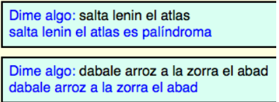
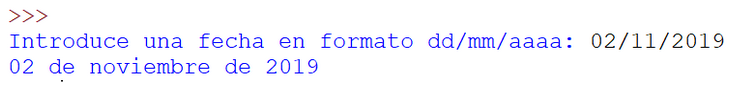

# Índice
- [Índice](#índice)
- [is\_palindromo](#is_palindromo)
- [numero\_palabras](#numero_palabras)
- [is\_primo](#is_primo)
- [diccionario\_fecha](#diccionario_fecha)
- [gestion\_contactos](#gestion_contactos)

# is_palindromo
Escribe un programa que te pida una frase, y pase la frase como parámetro a una función. Ésta debe devolver si es palíndroma o no, y el programa principal escribirá el resultado por pantalla:

# numero_palabras
Escribir un programa que lea una frase, y pase ésta como parámetro a una función que debe contar el número de palabras que contiene. El resultado se debe imprimir en el programa principal. 
- Asume que cada palabra está separada por un solo blanco.
- No se sabe cómo están separadas las palabras. Pueden estar separadas por más de un blanco o por signos de puntuación.

# is_primo
Escribe un programa que le pida al usuario si quiere calcular si un número es primo deberéis utilizar for o con while, por tanto, habrá dos funciones que se caracterizan por hacer ese mismo cálculo de una manera (con for y sin breaks), o de otra (con while). Ambas funciones devolverán true (si es primo) o false (si no es primo). El programa principal informará del resultado. Además, como mejora puedes calcular el tiempo que tarda en encontrar la solución de una manera u otra. 
*Comentario: aprovecha el código que tienes ya creado.*

# diccionario_fecha
Aprovechando el potencial de los diccionarios, escribe un programa que llame a un procedimiento, que recibe como parámetro la fecha en números y devuelve la fecha con el nombre del mes. 
*Comentario: no es necesario validar si la es correcta, damos por hecho que lo será.*

# gestion_contactos
Desarrolla un programa, que nos sirva para gestionar nuestros contactos (la información a gestionar será el teléfono, nombre, apellido1, apellido2 y correo electrónico. El programa tendrá un menú, con las siguientes opciones: añadir contacto, consultar contacto a partir de la clave, consultar todos los contactos y eliminar contacto. Aprovecha lo que has aprendido hasta el momento (diccionarios, funciones, procedimientos…).