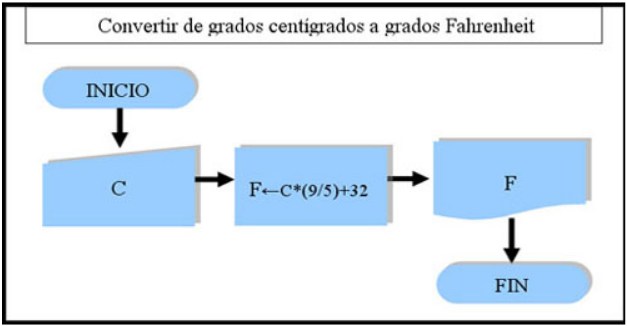
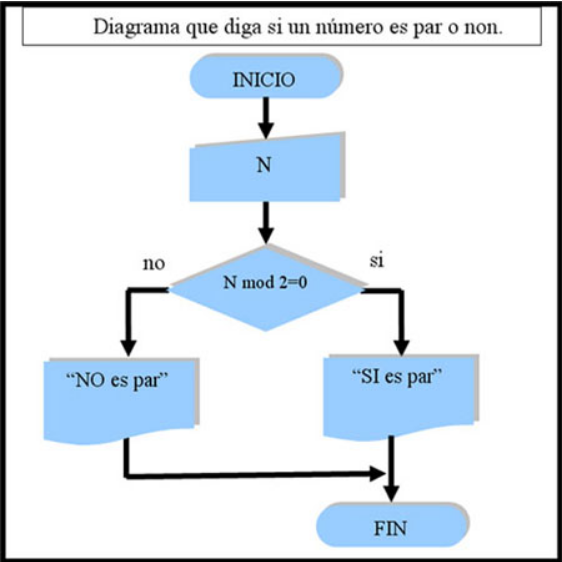
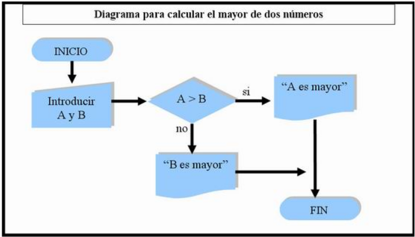

# Práctica 1
## Introducción a Python.

## Índice
- [Práctica 1](#práctica-1)
  - [Introducción a Python.](#introducción-a-python)
  - [Índice](#índice)
- [Ejercicio 1](#ejercicio-1)
- [Ejercicio 2](#ejercicio-2)
- [Ejercicio 3](#ejercicio-3)
- [Ejercicio 4](#ejercicio-4)

Teniendo en cuenta los siguientes diagramas de flujo, escribe el programa correspondiente.

# Ejercicio 1

# Ejercicio 2

# Ejercicio 3

# Ejercicio 4
